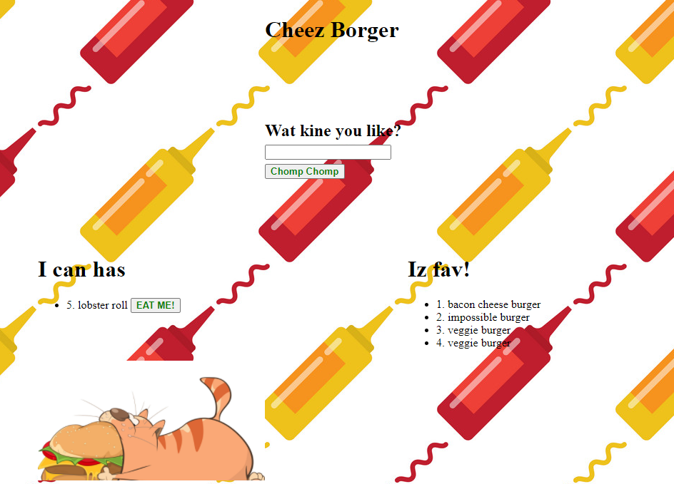

# CheezBorger

 

Cheezborger! Cheezborger! Cheezborger! Pepsi, no Coke! I am from Chicago and that is how we order-up our favorite beef sandwhich. In this simple application you can keep track of which burgers you have tried, and which ones are so good they can make it to your Iz Fav section. This is a full stack application made from backend to front end with a MySQL database utilizing a homegrown ORM.
       
## Table of Contents
        
- [Technologies](#technologies)
- [Installation](#installation)
- [Usage](#usage)
- [Credits](#credits)
- [License](#license)
- [Questions](#questions)

### Technologies
    
The technologies utilized in this application are as follows: MySQL database, Heroku, and handlebars.js. 
- MySQL database was used because This database works as persistent storage of your employees.
- Heroku is a free platform to deploy your application
- Handlebars.js was used as a templating engine to create small re-usable parts that can handle logic.
    
### Installation
    
To run this application successfully follow these steps:
1. Install [CheezBorger](https://github.com/JoannaTanveer/CheezBorger) to your local drive vis terminal/GitBash. This will install the package.json file which contains a list of all the dependencies for this application. 

2. Verify that node is installed in your computer by typing 'node' in the terminal/GitBash. If it returns
    >Welcome to Node.js v12.14.1. (or higher)
    >
    >Type ".help" for more information.
    
 Node.js is installed in your computer. If nothing happens or there is an error, visit [Node.js](https://nodejs.org/) and install the LTS version.
3. Type 'npm install' while in the terminal to install the dependencies. 
4. Type node server.js once in the directory to launch the server. 

### Usage
    
The purpose of this program is to create a total application from front end to backend. 
    
### Credits
    
The Dev community prides itself in the open source culture that it celebrates and maintains. This application couldn't have been made possible without the help of
- Anthony Zachry for his help with all parts. [Anthony Zachry](https://www.linkedin.com/in/anthony-zachry-3464b551/)
- Gretchen Grimm with help undertstanding handlebars. [Gretchen Grimm](https://www.linkedin.com/in/gretchen-grimm-75b6391aa/)
- Esterling Eccime youtube series which also helped me to usedstand handlebars and the flow of data in a full stack application. [Esterling Eccime](https://www.youtube.com/watch?v=erfN7fH7A6s)
    
#### Thank You!
    
    
### License
Licensed under the MIT license. 

### Questions
All questions and comments are welcome! Please contact me at joanna.tanveer@gmail.com	 or visit my [Github Profile](https://github.com/JoannaTanveer).
